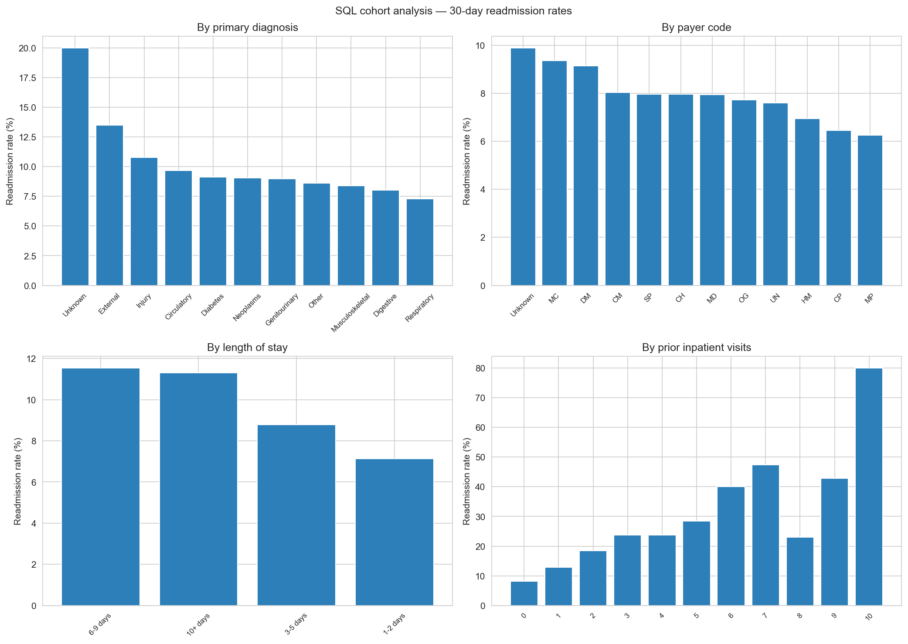
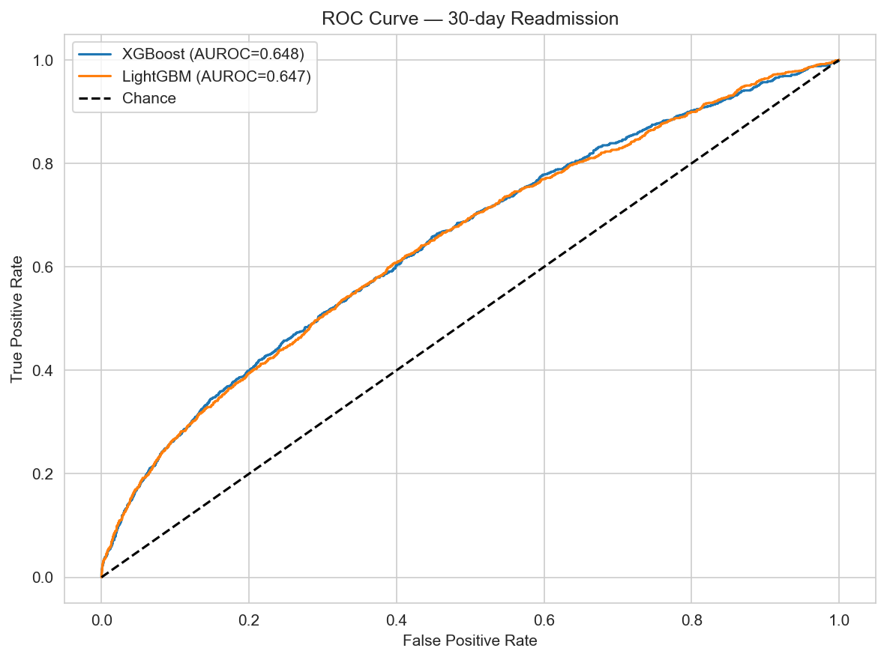
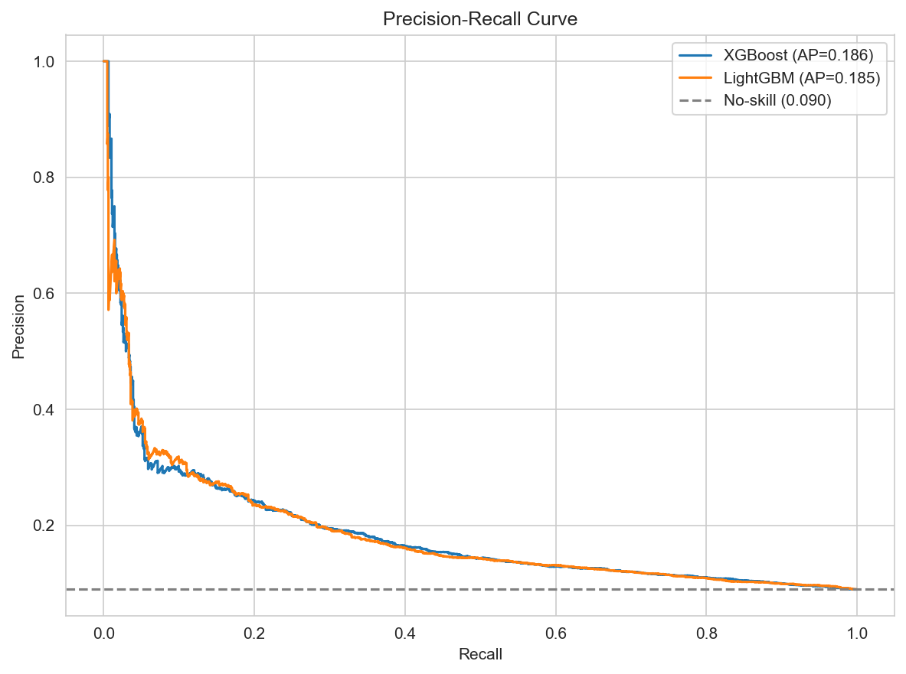
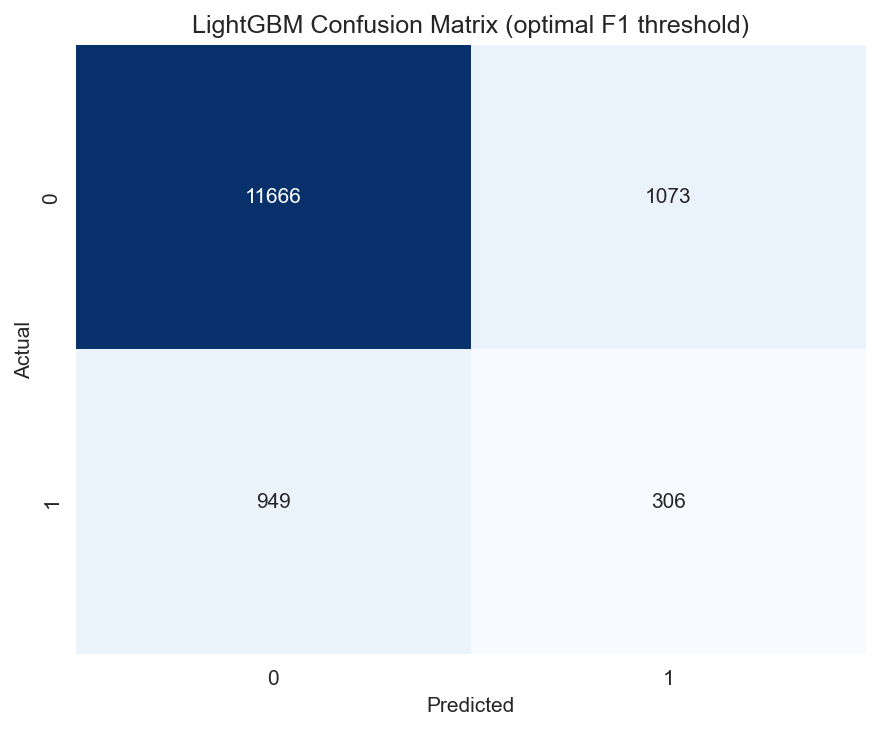
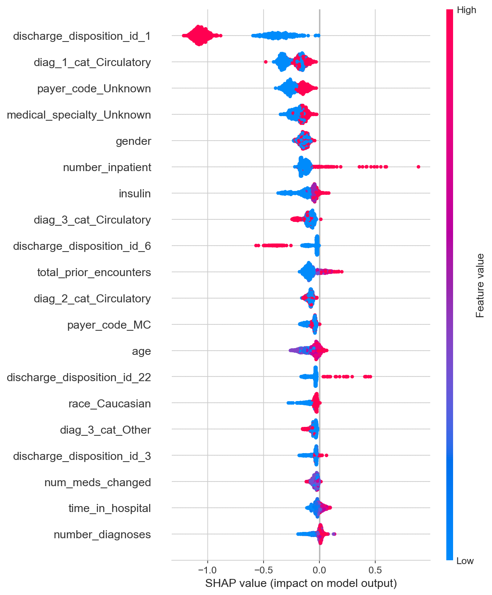
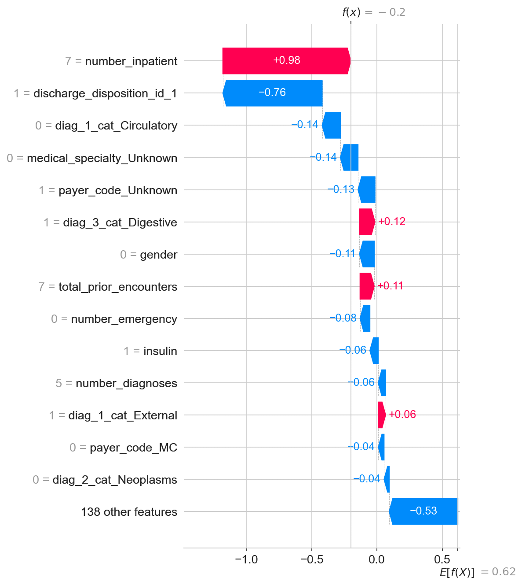

# Hospital Readmission Risk Predictor

## 1. Project Overview

This project is an end-to-end machine learning pipeline that estimates 30-day hospital readmission risk for diabetic inpatients. It uses the public UCI Diabetes 130-US Hospitals dataset (101,766 encounters, 50 raw features). The served model returns a readmission probability, a LOW / MEDIUM / HIGH risk tier, and the top SHAP drivers for that patient.

## 2. Motivation

Unplanned 30-day readmissions are expensive for hospitals and disruptive for patients. CMS’s Hospital Readmission Reduction Program financially penalizes hospitals with excess readmissions, so even a modest, well-targeted reduction has a direct P&L impact. A model that flags high-risk diabetic discharges at the point of care lets care teams prioritize follow-up calls, medication reconciliation, and post-acute support instead of treating every discharge the same.

## 3. Dataset

- **Source:** [UCI Diabetes 130-US Hospitals (1999–2008)](https://archive.ics.uci.edu/ml/machine-learning-databases/00296/dataset_diabetes.zip)
- **Raw size:** 101,766 encounters × 50 columns
- **After cleaning:** 69,970 first-encounters per patient (expired/hospice discharges removed)
- **Target:** `readmitted_binary = 1` if `readmitted == "<30"`, else `0`
- **Class balance after cleaning:** **8.97% positive** (raw file is ~11% before dedup and hospice/expiry filters)

The positive class is intentionally rare. Accuracy would look strong while missing almost every readmission, which is why training and evaluation use AUROC, average precision, class weights, and SMOTE rather than accuracy.

## 4. Architecture Diagram

```
Raw CSV (data/raw)
        |
        v
   src/ingest.py  ---- cleaned.parquet ---->  src/db.py  ---->  PostgreSQL
        |                                      |                 |
        |                                      v                 v
        |                               cohort CSVs         SQL views
        v
   src/features.py  (ICD-9 map, encoding, engineered features)
        |
        v
   src/train.py  -->  XGBoost baseline  +  LightGBM (SMOTE + Optuna)
        |
        v
   src/evaluate.py  -->  AUROC / PR / confusion / SHAP  -->  plots/
        |
        v
   FastAPI /predict  (src/predict.py + SHAP)  -->  Docker Compose (API + Postgres)
```

## 5. SQL Cohort Analysis

These four aggregations match `sql/02_cohort_analysis.sql`. They were also produced from the cleaned table when Postgres was not running locally.



**Primary diagnosis.** Encounters coded as External injury/poisoning had a 13.49% 30-day readmission rate (919 encounters), vs 8.97% overall. Circulatory disease is the largest group (21,383 encounters) at 9.67%. Respiratory primary diagnoses sat below average at 7.28%.

**Payer.** Missing/unknown payer codes (30,414 encounters) had the highest rate at 9.89%, followed by Medicare (`MC`) at 9.36%. Blue Cross (`BC`) was substantially lower at 5.98%, consistent with a younger or commercially insured mix.

**Length of stay.** Stays of 6–9 days (11.54%) and 10+ days (11.31%) readmitted more than 1–2 day stays (7.14%). Longer index admissions are a proxy for residual complexity at discharge.

**Prior inpatient use.** Readmission rises almost monotonically with prior inpatient visits: 8.12% with none, 12.89% with one, 18.52% with two, and 23.76% with three. Utilization history is one of the strongest cohort signals in this dataset.

## 6. ML Pipeline Decisions

XGBoost is the baseline: gradient boosting with `scale_pos_weight` to offset the ~9% positive rate, and `eval_metric='aucpr'` because precision-recall is more informative than accuracy under imbalance. LightGBM is the production model. It is trained on SMOTE-resampled training data and tuned with Optuna (20 trials, 3-fold CV on AUROC), then refit with the best hyperparameters.

AUROC is the headline metric because a classifier that always predicts “not readmitted” would be ~91% accurate and still useless. Average precision captures the same imbalance from the precision-recall side. SMOTE interpolates minority-class neighbors in feature space, which can invent unrealistic combinations and leak a slightly optimistic CV score (here ~0.96 on the balanced train folds). Class weights leave the original rows untouched and only reweight the loss; they are simpler and do not invent patients, but they can under-fit minority structure. This project uses both: class weights on XGBoost, SMOTE on LightGBM, and compares them on an untouched test set.

The decision threshold is not 0.5. At 0.5 most probabilities on this task fall below the cutoff and recall collapses. The LightGBM operating point is the F1-maximizing threshold on the original (not SMOTE) training predictions, which landed at **0.17**. Risk tiers for the API are separate from that cutoff: `<0.2` LOW, `0.2–0.4` MEDIUM, `>0.4` HIGH.

## 7. Results

Test set: 13,994 encounters, ~8.97% positive. Optuna search was 20 trials (not 50) to keep runtime practical.

| Metric | XGBoost | LightGBM |
|---|---|---|
| AUROC | 0.648 | 0.647 |
| Avg Precision | 0.186 | 0.185 |
| F1 (own optimal threshold) | 0.238 (thr=0.57) | 0.232 (thr=0.17) |

These AUROCs are in the typical published range for this dataset (~0.63–0.67). Average precision of ~0.19 is about 2× the 0.09 no-skill baseline.








## 8. SHAP Explainability

A SHAP value is the contribution of one feature to one prediction, relative to the model’s average output. Positive values raise 30-day readmission probability; negative values lower it. The beeswarm ranks features by mean absolute SHAP across a 1,000-row test subsample.

The three strongest global drivers are:

1. **`discharge_disposition_id_1`** (discharged to home) — being sent home pulls risk down.
2. **`diag_1_cat_Circulatory`** — a circulatory primary diagnosis pushes risk up.
3. **`number_inpatient` / prior utilization** — more inpatient visits in the prior year raise risk; this matches the SQL cohort gradient.

The waterfall plot is one true-positive test patient: it shows how those same factors stack for a single discharge rather than in aggregate.


## 9. API Usage

```bash
curl -X POST http://localhost:8000/predict ^
  -H "Content-Type: application/json" ^
  -d @tests/sample_payload.json
```

Unix:

```bash
curl -X POST http://localhost:8000/predict \
  -H "Content-Type: application/json" \
  -d @tests/sample_payload.json
```

Example payload:

```json
{
  "race": "Caucasian",
  "gender": "Female",
  "age": "[50-60)",
  "admission_type_id": 1,
  "discharge_disposition_id": 1,
  "admission_source_id": 7,
  "time_in_hospital": 4,
  "payer_code": "MC",
  "medical_specialty": "InternalMedicine",
  "num_lab_procedures": 44,
  "num_procedures": 0,
  "num_medications": 16,
  "number_outpatient": 0,
  "number_emergency": 0,
  "number_inpatient": 0,
  "number_diagnoses": 8,
  "diag_1": "428",
  "diag_2": "250.01",
  "diag_3": "401",
  "insulin": "Steady",
  "change": "Ch",
  "diabetesMed": "Yes",
  "a1c_result": "None"
}
```

Response shape: `readmission_probability` (0–1), `readmission_risk` (`LOW` / `MEDIUM` / `HIGH`), `top_risk_factors` (top 5 SHAP feature names).

## 10. How to Run

```bash
git clone <this-repo>
cd readmission-risk-predictor
cp .env.example .env

python -m pip install -r requirements.txt

python -m src.ingest
python -m src.features
python -m src.db
python -m src.train
python -m src.evaluate

# API (local)
python -m uvicorn api.main:app --host 0.0.0.0 --port 8000

# API + Postgres (needs Docker)
docker compose up --build

curl -X POST http://localhost:8000/predict -H "Content-Type: application/json" -d @tests/sample_payload.json
```

Place `diabetic_data.csv` and `IDS_mapping.csv` in `data/raw/` first (already present in this workspace). `src/ingest.py` skips the UCI download if those files exist.

Tests:

```bash
python -m pytest tests -q
```
